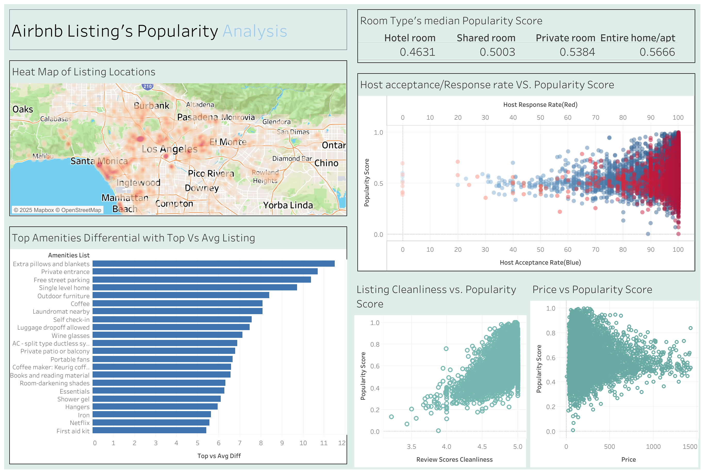

# Airbnb EDA: What makes a listing popular?
## Overview
> This exploratory data analysis examines Airbnb listings and the features they include to uncover which factors drive guest engagement and high performance.  
>  
> To define what makes a listing "popular," we used two main metrics: the **number of reviews** and the **overall review score**.  
>  
> This analysis helps **hosts create listings that better cater to guest needs and satisfaction**, ultimately improving their visibility, performance, and alignment with Airbnb’s mission: *“to create a world where anyone can belong anywhere.”*

# Tools 
- Python (Jupyter Notebook)
- Pandas, Numpy, Seaborn, Matplotlib, scikit-learn
- Tableau (Dashboard)

# 🧹 Data Transformation

To prepare the Airbnb listings dataset for analysis, the following steps were taken:

1. **Removed Outliers**  
   - Filtered out extreme values in price, number of reviews, and other numeric fields to reduce skew and improve analysis reliability.

2. **Dropped Irrelevant Columns**  
   - Removed columns that did not contribute meaningful insights (e.g. URLs, host names).

3. **Handled Missing Values**  
   - Filled or removed nulls depending on context and column importance (e.g. dropped rows with missing critical fields like price or review scores).

4. **Feature Engineered a Popularity Score**  
   - Created a new metric combining number of reviews and review score to quantify listing popularity.

5. **Filtered for Active Listings**  
   - Removed listings with none to very few reviews to focus on more established and relevant listings.

6. **Data Type Conversions**  
   - Converted columns like boolean and strings(e.g prices, percentages) to the appropriate types for analysis.
# Exploratory Data Analysis & Key Findings
Analysis was centered on the features of Airbnb listings and what features made a impact of a listings popularity score
### 🎯 Defining "Top" vs. "Average" Listings

To distinguish between high- and average-performing Airbnb listings, we used the **75th percentile (Q3)** of the popularity distribution as a cutoff:

- **Top Listings**: Listings in the **top 25% (≥ 75th percentile)** based on popularity indicators (e.g., number of reviews, review score).
- **Average Listings**: Listings in the **bottom 75% (< 75th percentile)**.

This quantile-based approach allows us to focus on established, high-performing listings while still comparing them to the general listing population.
## Key Findings:
- Price alone is not the sole factor: **affordability combined with quality features leads to better performance**
- Room type plays a factor to increase popularity as **Entire homes/apt and private rooms have a higher median/mean compared to shared spaces such as shared rooms and hotel rooms** in popularity score
- **Listings located near the coast or beaches**, especially in areas like Santa Monica and Venice, tend to have higher popularity scores.
- **Proximity to Downtown Los Angeles** and other major city centers is also a strong indicator of listing performance.
- **Top listings offer more than just basic amenities** — they often include thoughtful, quality-of-life features such as extra pillows and blankets, free street parking, and private patios or balconies. These comfort-focused amenities appear significantly more often in high-performing listings compared to average ones. Seen from the overall count of the same amenities in Top Vs Avg listings
- **Host responsiveness matters**: Listings managed by hosts with high acceptance rates and fast response times are significantly more likely to fall in the top listings. This suggests that reliable communication and guest approval contribute to better listing performance.
-  **Cleanliness ---

## 📈 Tableau Dashboard

👉 [View the interactive Tableau dashboard](https://public.tableau.com/views/AirBnbEDA/Dashboard1?:language=en-US&publish=yes&:sid=&:redirect=auth&:display_count=n&:origin=viz_share_link)

## 📝 Summary

This project analyzes Airbnb listings in Los Angeles to uncover what makes a listing popular and differeniate from the average listing by review count and score together. After transforming the data and exploring key features, we found that **location, thoughtful amenities, room type, and host responsiveness** all contribute to higher listing performance. Insights are supported by visualizations built in Tableau.

